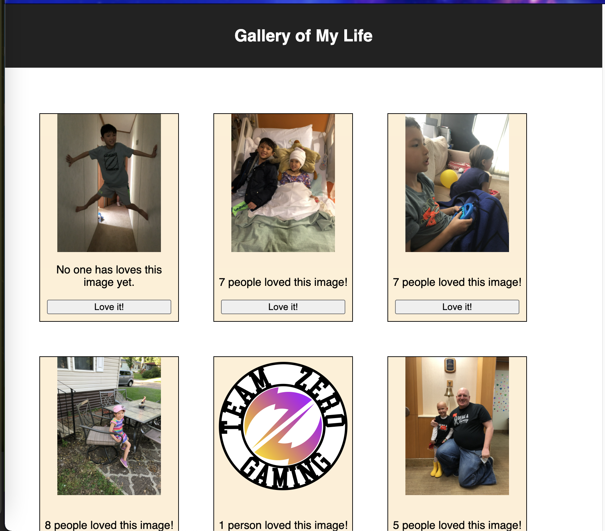
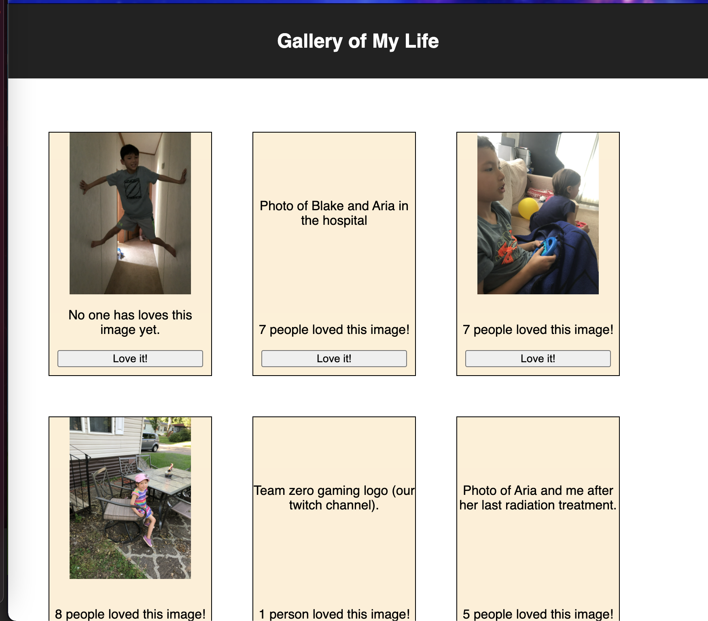

# PROJECT NAME

## Description

_Duration: Weekend Assignment_

This project displays pictures with a description that can be obtained by clicking the image, a "Love it!" button, and a counter to record how many times the love it button was clicked. 

It took a little bit to remember how to load something from a server file as I have gotten used to using a database. In a future update I may set up a database for this project but I wanted to ensure I met the base requirements for the assignment first. Another issue I ran into during development was the app trying to run the functions that rendered the images and data before it was received from the server files. I fixed this by using an if statement to load an empty div if the array variable was still empty. The last issue I ran into was trying to call a function to change the value of the hook that I used to determine if the image or its description were displayed caused an infinity loop. After some research, I found that a common solution to this problem is to have onClick run an anonymous function to call the function rather than calling the function directly (onClick={() => functionName()} vs. onClick={functionName()}).

To see the fully functional site, please visit: [DEPLOYED VERSION OF APP](www.heroku.com)

## Screen Shot

## Installation

1. Clone project to local device.
2. In a terminal on your IDE (instructions are made using Visual Studio Code), run npm install
3. In one terminal run npm run server
4. In a second terminal run npm run client

## Usage
How does someone use this application? Tell a user story here.

1. After the page loads, click on an image to view its description.
2. If you like an image, click the "Love it!" button to increase the love it counter. 

## Built With

- React
- express
- JavaScript
- HTML
- CSS

## Acknowledgement
Thanks to [Prime Digital Academy](www.primeacademy.io) who equipped and helped me to make this application a reality. 

Thanks to Mary for being an awesome instructor and helping me achieve my goals as a full stack developer.

Thanks to the students in the fortunate cohort from Prime Digital Academy for helping me with various coding roadblocks during this application.

Thanks to John and Marilyn Turner (parents) for helping me be able to continue developing applications during a difficult time in my life.

Finally, thanks to the Hendrickson family for helping me be able to attend Prime Digital Academy.

## Support
If you have suggestions or issues, please email me at [johnturner4004@gmail.com](mailto:johnturner4004@gmail.com)
